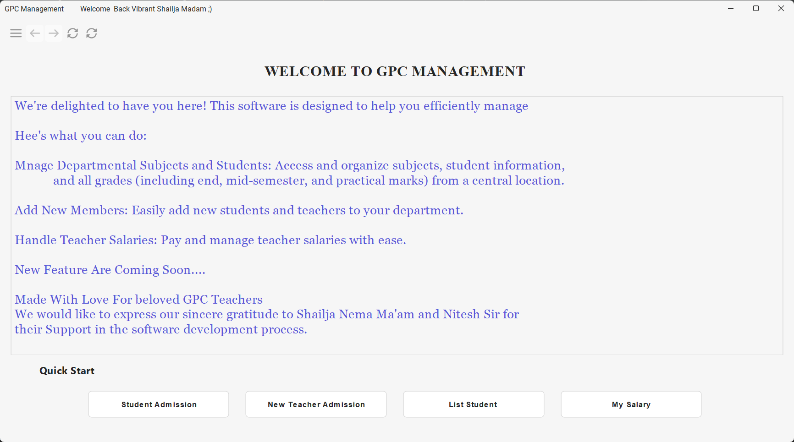

# Welcome to College Management Software

Credit: GUI Base is Taken from [@DJ-Raven] (https://www.github.com/DJ-Raven) www.github.com/DJ-Raven 

## Requirements
- Java Version 17
-  Internet Connection

## Features

- New Student
- Edit Student Details
- Generate Admission Report
- Teacher Details
- Teacher Salary
- Generate Salary Slip
- Subject Managements
- Student Fee Management
- Student Marks Management (Mid Sem & End Sem)

## Upcoming Features
- Generate T.C and Miragation Certificate
- Student Email Notification
- Student Performance Report

## Tech Stack
- Java Swing | GUI
- PostgresSQL |  Database
- Jasper report | Report Generation

## ScreenShot

